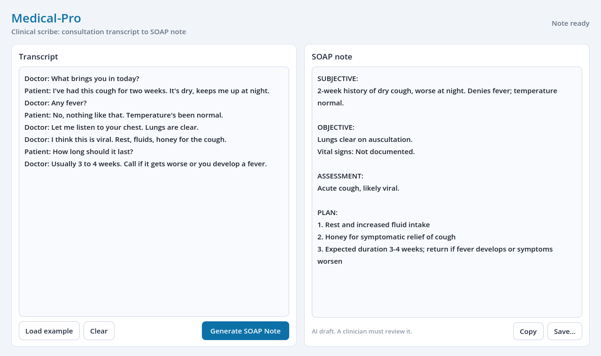
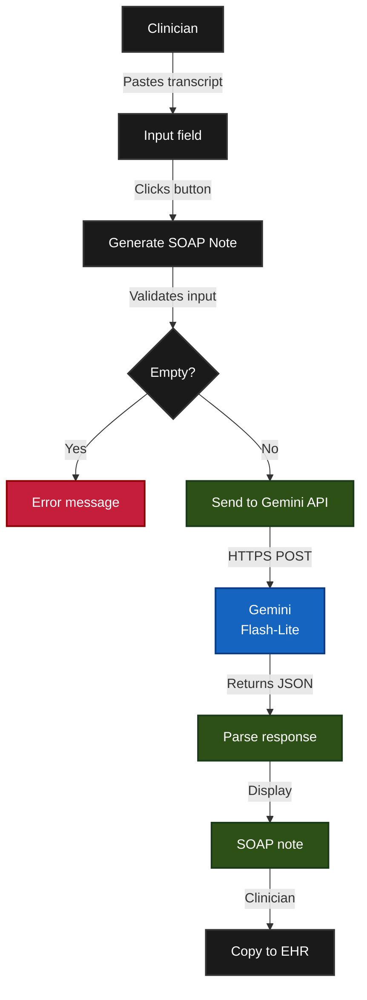
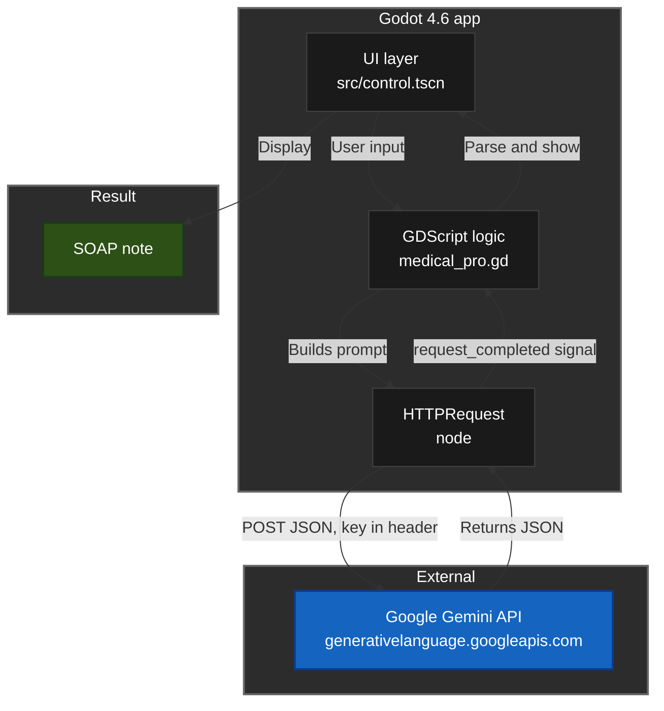
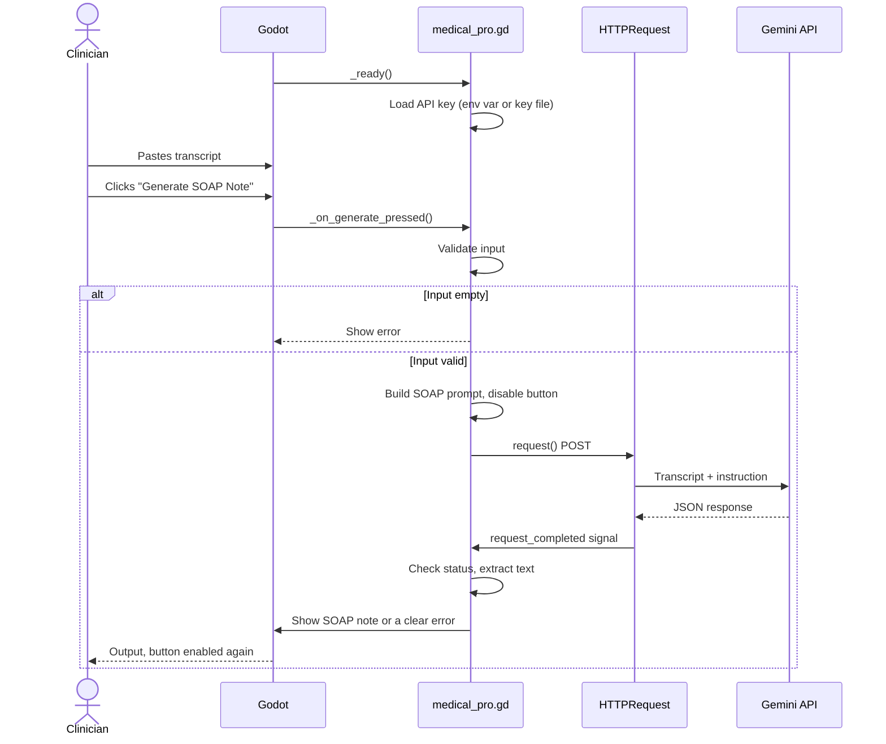

# Medical-Pro

[](https://github.com/kinuthia-mark/MedicalProV1/actions/workflows/ci.yml)


A small desktop app that turns a doctor-patient conversation transcript into a structured SOAP note, built with Godot 4 and Google's Gemini API.

Paste a transcript, press one button, and get back a note split into Subjective, Objective, Assessment and Plan, ready to copy into an EHR or save as a file.



*The screenshot is rendered automatically in CI by `tools/capture.gd`, so it always matches the current UI.*

---

## What it does

A clinician records and transcribes a consultation, then pastes the transcript into Medical-Pro. The app sends it to Gemini with a fixed instruction and shows the SOAP note that comes back.

The instruction tells the model to use only what is in the transcript, to write "Not documented" for anything that was not discussed, and not to ask follow-up questions or add small talk.

---

## Getting started

### 1. Get the code

```bash
git clone https://github.com/kinuthia-mark/MedicalProV1.git
cd MedicalProV1
```

### 2. Get a Gemini API key

- Go to [aistudio.google.com/app/apikey](https://aistudio.google.com/app/apikey)
- Click **Create API key** and copy it

### 3. Give the app your key

The key is never stored in the project. Use one of these:

**Option A: environment variable**

```bash
# Windows (PowerShell)
$env:GEMINI_API_KEY = "your-key"

# macOS / Linux
export GEMINI_API_KEY="your-key"
```

Then start Godot from the same terminal.

**Option B: key file**

Save the key on its own in a file called `gemini_api_key.txt` in Godot's user data folder for this project:

| OS | Folder |
|---|---|
| Windows | `%APPDATA%\Godot\app_userdata\medical-pro\` |
| macOS | `~/Library/Application Support/Godot/app_userdata/medical-pro/` |
| Linux | `~/.local/share/godot/app_userdata/medical-pro/` |

If no key is found, the app shows the exact path it looked in and disables the Generate button.

### 4. Run it

Open the `medical-pro/` folder in Godot 4.6 or newer and press **Run** (F5). Paste a transcript (or press **Load example**) and click **Generate SOAP Note**.

### Using the app

| Control | What it does |
|---|---|
| **Load example** | Fills in a short sample consultation so you can try the app straight away |
| **Clear** | Empties both boxes |
| **Generate SOAP Note** | Sends the transcript to Gemini. The button is disabled until the answer arrives, so a note cannot be requested twice |
| **Copy** | Puts the note on the clipboard, ready to paste into an EHR |
| **Save...** | Saves the note as a `.txt` or `.md` file |
| Status (top right) | Ready, Generating..., Note ready, Copied, Saved, or what went wrong |

Copy and Save stay disabled until there is a real note, so an error message can never be saved as if it were a note.

---

## The user flow



---

## System architecture



---

## What happens inside the app



---

## Example

**Input (raw transcript):**
```
Doctor: What brings you in today?
Patient: I've had this cough for two weeks. It's dry, keeps me up at night.
Doctor: Any fever?
Patient: No, nothing like that. Temperature's been normal.
Doctor: Let me listen to your chest.
Doctor: Lungs are clear. I think this is viral. Rest, fluids, honey for the cough.
Patient: How long should it last?
Doctor: Usually 3-4 weeks. Call if it gets worse or you develop a fever.
```

**Output (SOAP note):**
```
SUBJECTIVE:
Patient presents with a 2-week history of dry cough, worse at night.
Denies fever. Reports normal temperature.

OBJECTIVE:
Lungs: clear to auscultation.
Vital signs: Not documented.

ASSESSMENT:
Acute cough, likely viral.

PLAN:
1. Rest and increased fluid intake
2. Honey for symptomatic relief of cough
3. Return if fever develops, symptoms worsen, or the cough lasts beyond 3-4 weeks
```

---

## Project structure

```text
MedicalProV1/
├── medical-pro/                 # The Godot project (open this folder in Godot)
│   ├── project.godot            # Project settings, main scene
│   ├── medical_pro.gd           # UI wiring: buttons, status, copy and save
│   ├── soap_logic.gd            # Testable logic: key loading, request, parsing, error messages
│   ├── src/control.tscn         # The UI: two panels, theme, buttons, save dialog
│   ├── tests/run_tests.gd       # 30 headless unit tests for soap_logic.gd
│   ├── tools/capture.gd         # Renders the README screenshot
│   └── icon.svg
├── docs/screenshots/app.png     # Screenshot rendered by CI
├── .github/workflows/ci.yml     # Lint plus a headless Godot import on every push
├── LICENSE
└── README.md
```

---

## Settings

The values at the top of `soap_logic.gd` can be changed:

| Constant | Default | What it does |
|---|---|---|
| `MODEL` | `gemini-3.1-flash-lite` | Which Gemini model to call |
| `TEMPERATURE` | `0.1` | How much the wording varies. Lower is stricter |
| `MAX_OUTPUT_TOKENS` | `1000` | Maximum length of the note. Raise to 2000 for long consultations |
| `REQUEST_TIMEOUT_SECONDS` | `60` | How long to wait before giving up |
| `PROMPT` | see file | The instruction sent with every transcript |

---

## Error messages

| Message | Meaning |
|---|---|
| No API key found | Neither `GEMINI_API_KEY` nor the key file is set. The message shows the file path |
| Error: paste a transcript first | The input box is empty |
| Error 401 / 403 | The key was refused. Create a new one in AI Studio |
| Error 404 | The model name in `MODEL` does not exist for your key |
| Error 429 | Rate limit reached. Wait a minute |
| Request timed out | No answer within 60 seconds |
| Could not reach the Gemini API | No internet connection or DNS failure |

---

## Checks

GitHub Actions runs on every push and pull request:

- `gdlint` and `gdformat --check` from [gdtoolkit](https://github.com/Scony/godot-gdscript-toolkit)
- a headless Godot 4.6 import of the project, which fails if any script or scene has an error
- **30 unit tests** (`tests/run_tests.gd`) for request building, response parsing, error messages, API key loading and save paths. They check, for example, that the key is sent in a header and never appears in the URL, and that a malformed or empty Gemini response returns an empty note instead of crashing
- a screenshot render: the app is started under a virtual display with software OpenGL, filled with the example, and saved as a PNG artifact

To run the unit tests locally:

```bash
godot --headless --path medical-pro --script res://tests/run_tests.gd
```

### Why the logic is split out

`medical_pro.gd` only connects buttons to actions. Everything that can go wrong with the API (building the request, reading the response, turning error codes into messages) lives in `soap_logic.gd` as static functions with no UI and no network calls, so it can be tested in milliseconds without a window or an API key.

To run the lint locally:

```bash
pip install "gdtoolkit==4.*"
gdlint medical-pro/
gdformat --check medical-pro/
```

---

## Limitations

- **Not a medical device.** Every note must be checked by a clinician before it is used.
- **Data leaves the machine.** Transcripts are sent to Google's servers. Do not use real patient data unless your organisation has an agreement with Google that covers it.
- **No storage.** Nothing is saved, so nothing is encrypted at rest either. Adding saving would need encryption.
- **The model can make mistakes.** It can miss details or phrase things wrongly.

---

## Ideas for next steps

- Record audio and transcribe it inside the app
- Editable prompt templates for different specialties
- Export builds for Windows, macOS and Linux

---

## Tech stack

- **Engine:** Godot 4.6
- **Language:** GDScript
- **AI:** Google Gemini API (Flash-Lite model)
- **HTTP:** Godot's built-in HTTPRequest node
- **CI:** GitHub Actions, gdtoolkit, headless Godot unit tests, xvfb screenshot render

---

## License

MIT. See [LICENSE](LICENSE).

## Author

**Mark Kinuthia** - [github.com/kinuthia-mark](https://github.com/kinuthia-mark)
